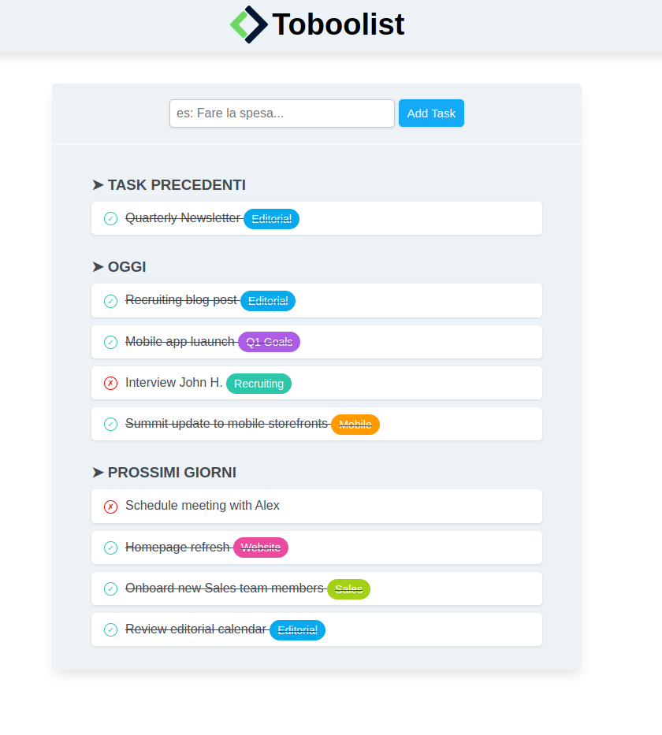

# 📋 To-Do List

This project is a simple web application to manage a to-do list. It allows users to add and view tasks.

## Project Structure

- `index.html`: The main HTML file.
- `css/style.css`: The CSS file for styling the page.
- `img/logo.png`: The logo used in the header.
- `img/screenshot.png`: Screenshot of the application.

## Features

- 📝 Viewing tasks.
- ➕ Adding new tasks via a form.

## Usage Instructions

1. Open the `index.html` file in a web browser.
2. Use the form to add new tasks to the list.

## Future Improvements

- 🗑️ Add JavaScript functionality to remove tasks.
- 📱 Improve responsive design for mobile devices.
- 🌐 Enhance accessibility and SEO.

## Screenshot

